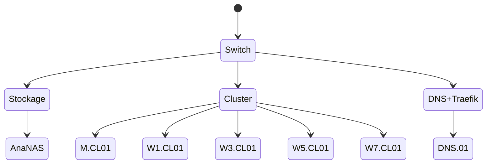

---
author:
  - name: Marc Proux
    email: marc@proux.onl
order: 100
title: Accueil
---

## Table des matières 

1. Cluster 
	1.1. Supervision 
  	1.1.1. Icinga2
    1.1.2. Grafana
  1.2. Logiciel 
  	1.2.1. Consul 
    1.2.2. Nomad 
    1.2.3. Vault 
2. Matériel 
	2.1. Réseau 
  	2.1.1. Firewall 
    2.1.2. Routeur 
    2.1.3. Switch 
  2.2. Serveur 
  	2.2.1. SBC 
    2.2.2. 2U 
    2.2.3. Stockage 
    	2.2.3.1. NAS-01 (custom) 

## Architecture

## Logiciel 
- HashiCorp Consul 
- HashiCorp Nomad 
- HashiCorp Vault 
- PiHole 
- Traefik 

## Matériel

### Réseau

| Statut | Type     | Modèle                 | Quantité | Informations                               | Lien | 
| ------ | -------- | ---------------------- | -------- | ------------------------------------------ | ---- | 
| ✅     | Switch   | Dell PowerConnect 2848 | 1        | 48 ports Ethernet 1Gb/s, 4 ports SFP 1Gb/s |      | 
| ❌     | Routeur  | Ubiquiti ER-8          |          | 8 ports Ethernet 1Gb/s                     |      | 
| ❌     | Firewall | En réflexion           |          |                                            |      | 

### Serveur

| Statut  | Type | Modèle                | Quantité            | Informations | Lien | 
| ------- | ---- | --------------------- | ------------------- | ------------ | ---- | 
| ✅      | SBC  | Odroid C2             | 1                   |              |      | 
| ❌      | SBC  | Odroid C4             | 4 **(besoin de 8)** |              |      | 
| ✅      | 2U   | IBM System X3650-7979 |                     |              |      |

### Stockage

| Statut   | Type | Modèle | Quantité | Informations                                                              | Lien | 
| -------- | ---- | ------ | -------- | ------------------------------------------------------------------------- | ---- | 
| ❌       | NAS  | Custom | 1        | 2 disques de 250Go en Raid1, 6 disques de 2To en Raid5                   |      |
